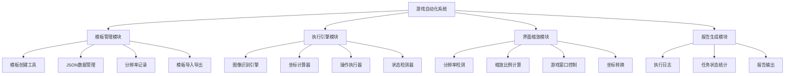
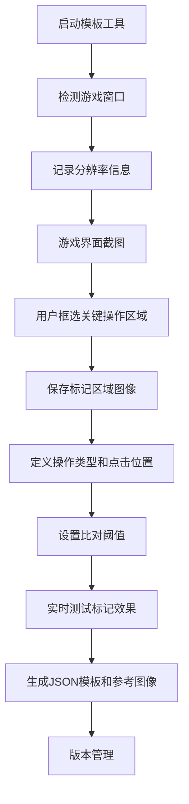
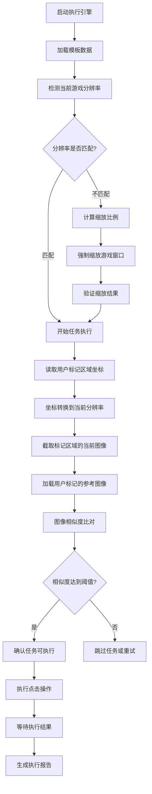

# 🎯 游戏自动化系统产品需求文档（PRD）

**产品设计师：Anna**  
**文档版本：v1.0**  
**创建时间：2024-12-17**  
**项目名称：基于OCR和图像识别的小程序游戏自动化系统**

## 📋 项目概述

### 产品定位
基于OCR和图像识别技术的通用小程序游戏自动化系统，采用模板驱动架构，支持所有小程序游戏的自动化任务执行。

### 核心特性
- **模板驱动**：所有功能通过JSON模板配置实现
- **通用兼容**：支持市面上所有小程序游戏
- **分辨率适配**：记录模板分辨率并支持游戏界面强制缩放
- **仿人工操作**：基于图像识别的鼠标操作模拟
- **版本管理**：模板版本控制和历史回滚

## 🏗 系统架构设计



## 📄 JSON模板数据结构

```json
{
  "template_info": {
    "name": "每日签到模板",
    "version": "v1.0_20241217_143022",
    "game_name": "示例小程序游戏",
    "description": "每日签到任务自动化模板",
    "created_time": "2024-12-17 14:30:22",
    "template_resolution": {
      "width": 1920,
      "height": 1080,
      "dpi": 96
    },
    "game_window_info": {
      "window_title": "微信",
      "game_area": {
        "x": 100,
        "y": 100,
        "width": 800,
        "height": 600
      }
    }
  },
  "tasks": [
    {
      "task_id": "daily_signin",
      "task_name": "每日签到",
      "priority": 1,
      "enabled": true,
      "steps": [
        {
          "step_id": "signin_button_check",
          "action_type": "image_verify_and_click",
          "user_marked_area": {
            "x": 400,
            "y": 300,
            "width": 120,
            "height": 40
          },
          "reference_image": "signin_button_marked.png",
          "match_threshold": 0.85,
          "click_point": {
            "x": 460,
            "y": 320
          },
          "wait_after": 2000
        },
        {
          "step_id": "signin_success_verify",
          "action_type": "image_verify_only",
          "user_marked_area": {
            "x": 350,
            "y": 200,
            "width": 200,
            "height": 50
          },
          "reference_image": "signin_success_marked.png",
          "match_threshold": 0.8,
          "timeout": 5000
        }
      ]
    }
  ],
  "global_settings": {
    "max_retry": 3,
    "step_delay": 1000,
    "screenshot_path": "./screenshots/",
    "reference_images_path": "./templates/images/",
    "log_level": "INFO",
    "auto_scale": true,
    "scale_method": "force_resize"
  }
}
```

## 🎨 模板管理系统

### 模板创建流程（用户标记为核心）


### 用户标记管理功能
1. **可视化标记**：用户通过鼠标框选游戏界面的关键操作区域
2. **参考图像保存**：自动保存用户标记区域的图像作为参考
3. **操作点定义**：用户可以精确定义点击位置（相对于标记区域）
4. **阈值配置**：用户可以调整图像比对的相似度阈值
5. **实时预览**：提供实时预览功能验证标记效果

## ⚙️ 执行引擎系统

### 执行流程（核心图像比对逻辑）


### 核心执行模块
1. **分辨率检测**：实时检测游戏窗口当前分辨率
2. **坐标转换**：将用户标记的区域坐标转换为当前分辨率下的实际坐标
3. **区域截图**：根据转换后的坐标截取游戏界面的指定区域
4. **图像比对**：将截取的区域图像与用户标记的参考图像进行相似度比对
5. **执行确认**：只有比对成功才执行对应的操作（点击、验证等）

## 🛠 技术实现规格

### 核心执行逻辑技术方案
```python
# 图像比对执行核心逻辑
class ImageMatchExecutor:
    def __init__(self, template_resolution, current_resolution):
        self.template_res = template_resolution
        self.current_res = current_resolution
        self.scale_ratio = self.calculate_scale_ratio()

    def calculate_scale_ratio(self):
        return {
            'x': self.current_res['width'] / self.template_res['width'],
            'y': self.current_res['height'] / self.template_res['height']
        }

    def convert_marked_area_coordinates(self, marked_area):
        """将用户标记的区域坐标转换为当前分辨率下的坐标"""
        return {
            'x': int(marked_area['x'] * self.scale_ratio['x']),
            'y': int(marked_area['y'] * self.scale_ratio['y']),
            'width': int(marked_area['width'] * self.scale_ratio['x']),
            'height': int(marked_area['height'] * self.scale_ratio['y'])
        }

    def capture_area_screenshot(self, area_coords):
        """根据坐标截取指定区域的屏幕图像"""
        # 截取指定区域的图像
        pass

    def compare_images(self, current_image, reference_image, threshold):
        """比对当前截图与参考图像的相似度"""
        # 图像相似度计算
        similarity = self.calculate_similarity(current_image, reference_image)
        return similarity >= threshold

    def execute_if_match(self, step_config):
        """核心执行逻辑：比对成功才执行操作"""
        # 1. 转换用户标记区域坐标
        area_coords = self.convert_marked_area_coordinates(step_config['user_marked_area'])

        # 2. 截取当前游戏界面的对应区域
        current_image = self.capture_area_screenshot(area_coords)

        # 3. 加载用户标记的参考图像
        reference_image = self.load_reference_image(step_config['reference_image'])

        # 4. 进行图像比对
        if self.compare_images(current_image, reference_image, step_config['match_threshold']):
            # 5. 比对成功，执行对应操作
            if step_config['action_type'] == 'image_verify_and_click':
                click_coords = self.convert_click_coordinates(step_config['click_point'])
                self.perform_click(click_coords)
                return True
            elif step_config['action_type'] == 'image_verify_only':
                return True
        else:
            # 比对失败，跳过或重试
            return False
```

### 命令行工具

#### 模板创建工具
```bash
# 启动模板创建工具
python template_creator.py

# 功能菜单
1. 新建模板（自动检测分辨率）
2. 用户标记区域（可视化框选）
3. 设置操作类型和点击位置
4. 调整图像比对阈值
5. 实时测试标记效果
6. 保存模板和参考图像
7. 导入/导出模板
```

#### 标记操作流程
1. **区域框选**：用户用鼠标框选需要识别的游戏界面区域
2. **图像保存**：系统自动保存框选区域的图像作为参考
3. **操作定义**：用户定义该区域对应的操作（点击/验证）
4. **位置标记**：如果是点击操作，用户标记具体的点击位置
5. **阈值设置**：设置图像比对的相似度阈值（默认0.8）
6. **实时测试**：实时测试当前标记是否能正确识别

#### 执行引擎
```bash
# 执行指定模板（自动图像比对）
python game_executor.py --template daily_tasks.json

# 调试模式（显示比对过程）
python game_executor.py --template daily_tasks.json --debug

# 设置全局比对阈值
python game_executor.py --template daily_tasks.json --threshold 0.85

# 查看执行报告
python game_executor.py --report
```

#### 执行过程说明
1. **加载模板**：读取JSON模板和对应的参考图像文件
2. **坐标转换**：将模板中的标记坐标转换为当前分辨率坐标
3. **区域截图**：根据转换后的坐标截取游戏界面对应区域
4. **图像比对**：将截取的图像与参考图像进行相似度比对
5. **执行操作**：只有比对成功（相似度达到阈值）才执行操作
6. **结果记录**：记录每步的比对结果和执行状态

## 📊 执行报告系统

### 报告内容（含图像比对信息）
```json
{
  "report_info": {
    "date": "2024-12-17",
    "start_time": "09:00:00",
    "end_time": "09:15:32",
    "total_duration": "15分32秒"
  },
  "resolution_info": {
    "template_resolution": "1920x1080",
    "current_resolution": "1366x768",
    "scale_applied": true,
    "scale_ratio": {"x": 0.71, "y": 0.71}
  },
  "task_summary": {
    "total_tasks": 8,
    "completed": 6,
    "failed": 2,
    "skipped": 0,
    "success_rate": "75%"
  },
  "task_details": [
    {
      "task_name": "每日签到",
      "status": "completed",
      "execution_time": "2024-12-17 09:01:15",
      "duration": "3.2秒",
      "retry_count": 0,
      "steps": [
        {
          "step_name": "signin_button_check",
          "image_match_result": {
            "similarity": 0.92,
            "threshold": 0.85,
            "match_success": true,
            "marked_area": {"x": 284, "y": 213, "width": 85, "height": 28},
            "reference_image": "signin_button_marked.png"
          },
          "action_executed": true,
          "click_position": {"x": 327, "y": 227}
        }
      ]
    }
  ]
}
```

## 📁 项目文件结构

```
autoGame-xcx/
├── src/
│   ├── template_creator.py      # 模板创建工具（用户标记界面）
│   ├── game_executor.py         # 执行引擎（图像比对核心）
│   ├── image_matcher.py         # 图像比对模块
│   ├── coordinate_converter.py  # 坐标转换模块
│   ├── area_capturer.py         # 区域截图模块
│   ├── window_controller.py     # 窗口控制模块
│   └── report_generator.py      # 报告生成模块
├── templates/
│   ├── daily_tasks_v1.0_20241217_143022.json
│   ├── weekly_tasks_v1.0_20241217_150000.json
│   └── custom_activity_v1.0_20241217_160000.json
├── reference_images/            # 用户标记的参考图像
│   ├── daily_tasks/
│   │   ├── signin_button_marked.png
│   │   ├── signin_success_marked.png
│   │   └── energy_collect_marked.png
│   └── weekly_tasks/
├── screenshots/                 # 截图缓存目录
├── reports/                     # 执行报告目录
├── logs/                        # 日志目录
└── doc/                         # 文档目录
    └── PRD_游戏自动化系统.md
```

## 🎯 核心优势

### 1. 用户标记驱动
- **可视化标记**：用户直接在游戏界面上框选关键操作区域
- **参考图像保存**：自动保存用户标记的区域图像作为比对基准
- **精确定位**：用户可精确定义点击位置和操作类型
- **实时验证**：提供实时预览功能验证标记效果

### 2. 图像比对执行
- **坐标转换**：将用户标记坐标转换为当前分辨率下的实际坐标
- **区域截图**：精确截取游戏界面的标记区域
- **相似度比对**：将当前截图与参考图像进行高精度比对
- **条件执行**：只有比对成功才执行对应操作，确保准确性

### 3. 模板驱动架构
- **JSON配置**：所有任务通过JSON模板统一配置
- **版本管理**：完整的模板版本控制系统
- **易于分享**：标准格式便于模板分享和导入导出
- **详细报告**：记录每步的图像比对结果和执行状态

## 📋 开发优先级

### Phase 1: 核心功能（MVP）
1. 用户标记工具（可视化区域框选）
2. 图像比对引擎（相似度计算）
3. 坐标转换模块（分辨率适配）
4. 基础执行引擎（比对后执行）

### Phase 2: 完善功能
1. 高级模板创建工具（实时预览、阈值调整）
2. 完整的执行报告系统（详细比对信息）
3. 区域截图优化（提高截图精度）
4. 错误处理和重试机制

### Phase 3: 优化功能
1. 图像比对算法优化（提高识别精度）
2. 用户体验优化（更友好的标记界面）
3. 模板分享功能（导入导出优化）
4. 性能优化（提高执行速度）

---

**文档状态：已完成**  
**下一步：与noma工程师讨论技术实现方案**
